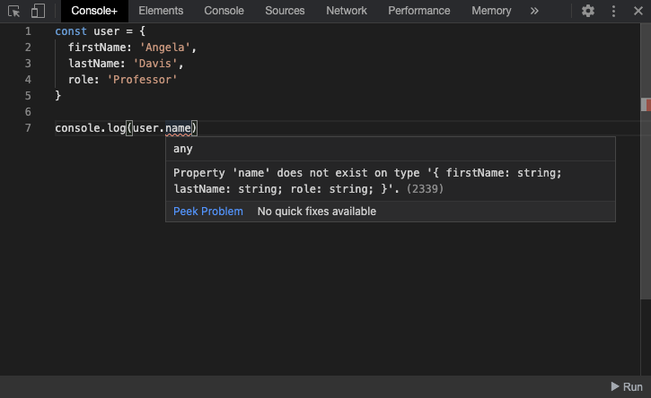

# Console+
Chrome extension which allows developers to run TypeScript code right from their browsers 💻



🗃 [Download from the Chrome Web Store](https://chrome.google.com/webstore/detail/console%20/mdpcfmohggcepdncbognlniaiefdpnnf)

## Stack
TypeScript | Monaco Editor | Node v13 | Chrome Extension API | Parcel.js | ESLint | Jest

## Development
1. Install dependencies using:
    ```bash
    npm install
    ```
2. Run the following to generate the Chrome Extension in `/dist`:
    ```bash
    npm run build
    ```
3. Go to `chrome://extensions/` and ensure "Developer mode" is on.
4. Click on "Load unpacked" and select the `/dist` directory.
5. To make further changes, run `npm run build` again then click on "Update".

## Contribution
Issues and Pull Requests are more than welcome.
